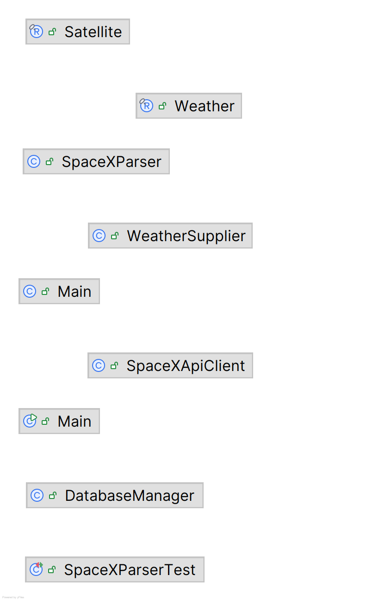

🚀 DACD Data App - Sprint 2 (Semana 1)
Aplicación de extracción y distribución de datos en tiempo real desarrollada en Java. Este sistema captura información de múltiples fuentes mediante APIs REST y distribuye los datos utilizando una Arquitectura Orientada a Eventos (EDA) a través de un Message Broker centralizado.

💡 Propuesta de Valor (Visión del Proyecto)
El objetivo final de este datamart es alimentar un Monitor Predictivo de Cobertura Satelital (Rain Fade). El sistema cruzará la trayectoria en tiempo real de los satélites de la constelación Starlink con eventos de clima adverso local (lluvia, densidad de nubes) para predecir microcortes en la conexión a internet satelital, aportando valor a nómadas digitales y trabajadores remotos en zonas rurales de Canarias.

🏗️ Arquitectura del Proyecto (Orientada a Eventos)
El proyecto sigue una estructura multi-módulo gestionada con Maven. En este sprint, se ha eliminado el acoplamiento directo a la base de datos, transformando los módulos en Productores (Publishers) independientes:

spacex-extractor (Productor): Módulo encargado de conectarse a la API de SpaceX para extraer la telemetría y posición orbital. Serializa los objetos a formato JSON (usando Gson) y publica los eventos en el Topic sensor.SpaceX.

weather-extractor (Productor): Módulo encargado de conectarse a OpenWeatherMap para capturar las condiciones meteorológicas locales. Publica las observaciones serializadas en formato JSON en el Topic prediction.Weather.

Message Broker (ActiveMQ): Actúa como el núcleo de comunicaciones (middleware). Recibe los eventos generados por los extractores y los clasifica en canales (Topics), asegurando que ninguna información se pierda a la espera de ser procesada por futuros Consumidores.

### Diagrama de Clases UML
A continuación se detalla la estructura interna de los módulos, destacando la separación de responsabilidades entre la conexión a las APIs, el modelo de datos y la persistencia:

🧩 Principios de Diseño Aplicados
Para asegurar la escalabilidad y mantenibilidad del código, se han aplicado los siguientes principios:

Responsabilidad Única (SRP): Cada clase tiene un único propósito (ej. OpenWeatherMapSupplier solo extrae datos, el componente de mensajería solo los publica).

Inversión de Dependencias (DIP): Los módulos dependen de abstracciones en lugar de implementaciones concretas, facilitando el cambio de librerías en el futuro.

Desacoplamiento Máximo (Patrón Pub/Sub): Los extractores ya no saben dónde ni cómo se guardan los datos. Simplemente "gritan" los eventos al Broker, permitiendo escalar el sistema añadiendo múltiples consumidores en el futuro sin modificar el código de extracción.

⚙️ Requisitos
Java 21 o superior (Variable JAVA_HOME configurada en el sistema).

Maven instalado.

Apache ActiveMQ (v6.2.x o superior) instalado en el equipo local.

API Key válida de OpenWeatherMap (Reemplazar en weather-extractor/src/.../Main.java).

▶️ Cómo ejecutar la aplicación
Dado que el sistema ahora está distribuido, se debe iniciar la infraestructura de mensajería antes que el código:

Iniciar el Broker (ActiveMQ):
Abre una consola (cmd o terminal) en el directorio bin de tu instalación de ActiveMQ y ejecuta: activemq start
Nota: Mantén esta consola abierta en segundo plano para que el servidor siga funcionando.

Compilar el proyecto:
Ejecuta mvn clean install en la raíz del proyecto para asegurar que las dependencias y la librería Gson estén enlazadas.

Ejecutar los Productores:
Desde tu IDE o terminal, ejecuta las clases Main de los módulos spacex-extractor y weather-extractor simultáneamente.

Verificación y Monitorización:
Para comprobar que los datos están fluyendo correctamente:

Abre tu navegador web y entra en la Consola de Administración de ActiveMQ: http://localhost:8161/admin (Credenciales por defecto: admin / admin).

Navega a la pestaña "Topics".

Verás los canales sensor.SpaceX y prediction.Weather, donde la columna "Messages Enqueued" aumentará a medida que tus extractores publiquen nueva información.
---
*Desarrollado para la asignatura Ciencia e Ingeniería de Datos. Pablo Mellado y Yone Suárez*