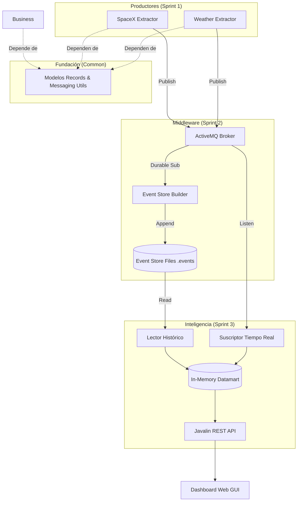

---

# 🛰️ Starlink Rain Fade Monitor - Proyecto DACD

**Desarrollo de Aplicaciones para Ciencia de Datos**
Grado en Ciencia e Ingeniería de Datos | ULPGC

👨‍💻 **Desarrolladores:** Pablo Mellado y Yone Suárez
☕ **Tecnología:** Java 21 (Modular Maven Project) | Apache ActiveMQ | Javalin | Leaflet.js

---

## 💡 Propuesta de Valor: Monitorización Predictiva de "Rain Fade"

El **Rain Fade** (atenuación por lluvia) es el principal factor de inestabilidad en las conexiones satelitales que operan en la Banda Ku (como Starlink de SpaceX). El objetivo de este sistema es actuar como un Monitor Predictivo, cruzando dos flujos de datos dinámicos en tiempo real:

1. **Telemetría Orbital:** Posición exacta (Latitud/Longitud) de los satélites de la constelación SpaceX.
2. **Meteorología Crítica:** Intensidad de precipitación y densidad de nubes (OpenWeatherMap) en las Islas Canarias.

**Resultado:** Un tablero de control que predice microcortes y alerta visualmente al usuario mediante un código de colores de riesgo y mapeo de interferencias antes de que se produzca la degradación de la señal. Esto aporta un valor crítico a nómadas digitales, empresas y trabajadores autónomos en Canarias que dependen de conexiones satelitales estables para operar.

---

## 🏗️ Arquitectura del Sistema (Multimódulo EDA)

El proyecto implementa una arquitectura de **Microservicios Desacoplados** comunicados mediante un bus de eventos (Event-Driven Architecture), diseñada bajo los principios de *Clean Code* y maximizando el principio DRY:

### Módulos del Proyecto
* **`common` (Librería Core):** Centraliza el modelo de dominio mediante **Java Records** (inmutabilidad) y utilidades de mensajería (`ActiveMQMessageSender`). Garantiza que todos los módulos compartan el mismo esquema de datos sin duplicación de código.
* **`spacex-extractor` & `weather-extractor` (Productores):** Feeders que capturan telemetría orbital y clima local desde APIs externas, inyectándolos en el ecosistema (topics `sensor.SpaceX` y `prediction.Weather`).
* **`event-store-builder` (Data Lake):** Implementa el patrón *Durable Subscriber*, escuchando al broker y persistiendo los eventos crudos en formato NDJSON. Actúa como la *Single Source of Truth* histórica.
* **`business-unit` (Datamart y API):** El cerebro del sistema. Implementa una **Arquitectura Lambda**, cargando históricos del Event Store (batch) y sincronizando el estado en tiempo real vía ActiveMQ (stream). Sirve los datos procesados a través de una API REST.

### 🗺️ Diagrama de Arquitectura Unificada



---

## 🧩 Patrones de Diseño y Decisiones Técnicas

* **Arquitectura Lambda:** Unifica el procesamiento por lotes del histórico con el flujo en tiempo real, garantizando que la `business-unit` siempre arranque con el estado más reciente.
* **Java Records (Java 21):** Uso extensivo de inmutabilidad para asegurar la integridad de los datos en hilos concurrentes y eliminar *boilerplate*.
* **Publisher/Subscriber (Observer):** Desacoplamiento total. Los extractores ignoran la existencia de la API, permitiendo escalar el sistema sin modificar el núcleo.
* **Tolerancia a Fallos (Resiliencia):** Configuración de protocolo `failover` en las colas de ActiveMQ para permitir reconexiones automáticas si el broker se cae.
* **Datamart en Memoria Volátil:** Implementado con `CopyOnWriteArrayList` para garantizar latencia cero. Permite a la API servir datos de forma segura mientras el suscriptor actualiza la memoria concurrentemente.
* **Almacenamiento en NDJSON:** Un JSON por línea facilita el procesamiento de flujos masivos, permitiendo que el Event Store crezca indefinidamente sin penalizar las lecturas secuenciales.

---

## ⚙️ Requisitos y Ejecución

### Requisitos Previos
* **Java 21** o superior (Variable `JAVA_HOME` configurada).
* **Maven** para la gestión del ciclo de vida del proyecto.
* **Apache ActiveMQ** (v5.15.x o superior) ejecutándose en local (puerto `61616`).
* **Variable de Entorno:** Configurar `OPENWEATHER_API_KEY` en el sistema operativo por seguridad.

### Pasos de Arranque
Debido a la naturaleza distribuida del sistema, se recomienda el siguiente orden:

1. **Compilar e Instalar:** En la raíz del proyecto, ejecuta `mvn clean install` (esto instala el módulo `common` localmente para que el resto lo pueda usar).
2. **Iniciar el Broker:** Ejecuta `activemq start` en tu instalación de Apache ActiveMQ.
3. **Levantar el Almacenamiento (Data Lake):** Ejecuta la clase `Main` del módulo `event-store-builder`.
4. **Levantar la Inteligencia (Business Unit):** Ejecuta la clase `Main` del módulo `business-unit`.
5. **Encender los Sensores (Productores):** Ejecuta las clases `Main` de `spacex-extractor` y `weather-extractor`.

---

## 📊 Explotación de Datos

La Business Unit expone los datos procesados para su integración y visualización:

### 1. API REST
* **Endpoint:** `GET /api/rainfade/{isla}`
* **Respuesta de ejemplo:**

```json
{
  "location": "Las Palmas",
  "requestTime": "2026-04-23T10:00:00Z",
  "predictions": [
    {
      "weather": {
        "temperature": 22.4,
        "description": "heavy rain"
      },
      "rainFadeRisk": "HIGH",
      "satellitesInView": [
        {
          "id": "STARLINK-123",
          "lat": 28.5,
          "lon": -15.2
        }
      ]
    }
  ]
}
```

### 2. Dashboard Web (GUI)
Accede a `http://localhost:8080/` para visualizar el monitor desarrollado con **Leaflet.js**. El panel incluye telemetría real, indicador de estado *LIVE* y un mapa dinámico donde las conexiones satelitales se representan visualmente según el nivel de riesgo en la zona seleccionada.