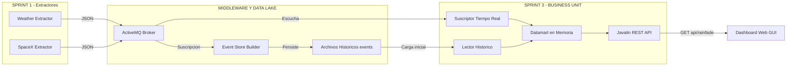

# 🚀 DACD Data App - Proyecto Final (Sprint 3)

**Desarrollo de Aplicaciones para Ciencia de Datos - Grado en Ciencia e Ingeniería de Datos (ULPGC)**
👨‍💻 **Desarrollado por:** Pablo Mellado y Yone Suárez

Aplicación de extracción, procesamiento y explotación de datos en tiempo real desarrollada en **Java 21**. Este sistema captura información de múltiples fuentes mediante APIs REST, la distribuye utilizando una Arquitectura Orientada a Eventos (EDA) a través de ActiveMQ, y la consume en una **Business Unit** para ofrecer predicciones a través de una API REST y una interfaz web gráfica (GUI).

---

## 💡 Propuesta de Valor

El objetivo de este sistema es actuar como un **Monitor Predictivo de Rain Fade (Atenuación por Lluvia)**. 

El sistema cruza la trayectoria en tiempo real de los satélites de la constelación Starlink (SpaceX) con eventos de clima adverso local (lluvia, densidad de nubes de OpenWeatherMap) para predecir microcortes en la conexión a internet satelital. Esto aporta un valor crítico a nómadas digitales, empresas y trabajadores autónomos en Canarias que dependen de conexiones satelitales estables para operar.

---

## 🏗️ Arquitectura del Proyecto y Módulos

El proyecto está diseñado bajo una arquitectura modular y distribuida, dividida en Productores (Feeders), Almacenamiento (Data Lake) y Consumo (Datamart):

* **`spacex-extractor` (Productor):** Conecta con la API de SpaceX para extraer telemetría orbital. Publica los eventos en JSON en el topic `sensor.SpaceX`.
* **`weather-extractor` (Productor):** Conecta con OpenWeatherMap para capturar condiciones meteorológicas locales. Publica en el topic `prediction.Weather`.
* **`event-store-builder` (Data Lake):** Suscriptor duradero que escucha al Broker y almacena los eventos crudos en disco duro (formato NDJSON). Actúa como la *Single Source of Truth* histórica.
* **`business-unit` (Datamart y API):** Módulo de explotación de datos desarrollado en el Sprint 3.
    * Lee el histórico de archivos `.events` para reconstruir su estado al arrancar.
    * Mantiene un **Datamart en Memoria Volátil** (usando `CopyOnWriteArrayList` para concurrencia segura) garantizando latencia cero.
    * Escucha en tiempo real a ActiveMQ para actualizar el datamart.
    * Sirve una **API REST** (Javalin) y un **Dashboard Web (HTML/JS)** interactivo que muestra el nivel de riesgo en tiempo real.

### 🗺️ Diagrama de Flujo

## 🧩 Patrones de Diseño Aplicados

Para asegurar la escalabilidad, resiliencia y limpieza del código (*Clean Code*), se han aplicado los siguientes patrones:

* **Publish/Subscribe (Observer):** Desacoplamiento total entre extractores y consumidores usando ActiveMQ. Los *feeders* no conocen la existencia de la API.
* **MVC Adaptado / Capas:** Separación estricta entre lógica de extracción, almacenamiento y capa de presentación.
* **Inyección de Dependencias:** El Datamart en memoria se instancia centralmente y se inyecta en los suscriptores y la API.
* **Tolerancia a Fallos (Resiliencia):** Implementación del protocolo `failover` en las colas de ActiveMQ para permitir reconexiones automáticas si el broker se cae.

---

## ⚙️ Requisitos y Dependencias

* **Java 21** o superior (Variable `JAVA_HOME` configurada).
* **Maven** para la gestión de ciclos de vida.
* **Apache ActiveMQ** (v5.15.x o superior) ejecutándose en local (puerto `61616`).
* **API Key de OpenWeatherMap:** Configurada en el sistema operativo como variable de entorno `OPENWEATHER_API_KEY` por motivos de seguridad (evitar *hardcoding*).
* **Dependencias clave:** `gson`, `activemq-client`, `javalin`, `okhttp3`.

---

## ▶️ Instrucciones de Ejecución

Debido a la naturaleza distribuida y dirigida por eventos del sistema, el orden de arranque recomendado es el siguiente:

1. **Iniciar el Broker:** Ejecuta `activemq start` en la consola de tu instalación de Apache ActiveMQ.
2. **Compilar el Proyecto:** En la raíz del proyecto, ejecuta `mvn clean install` para construir todos los módulos.
3. **Levantar el Almacenamiento (Sprint 2):** Ejecuta la clase `Main` del módulo `event-store-builder`.
4. **Levantar la Business Unit (Sprint 3):** Ejecuta la clase `Main` del módulo `business-unit`. La consola indicará que se han cargado los históricos y que la API REST está funcionando en el puerto `8080`.
5. **Encender los Sensores (Sprint 1):** Ejecuta las clases `Main` de `spacex-extractor` y `weather-extractor`.
6. **Visualización en Vivo:** Abre tu navegador web y dirígete a `http://localhost:8080/`. Utiliza el botón de actualización para ver cómo los datos fluyen en tiempo real desde los extractores hasta la interfaz gráfica, modificando los niveles de riesgo de Rain Fade.
