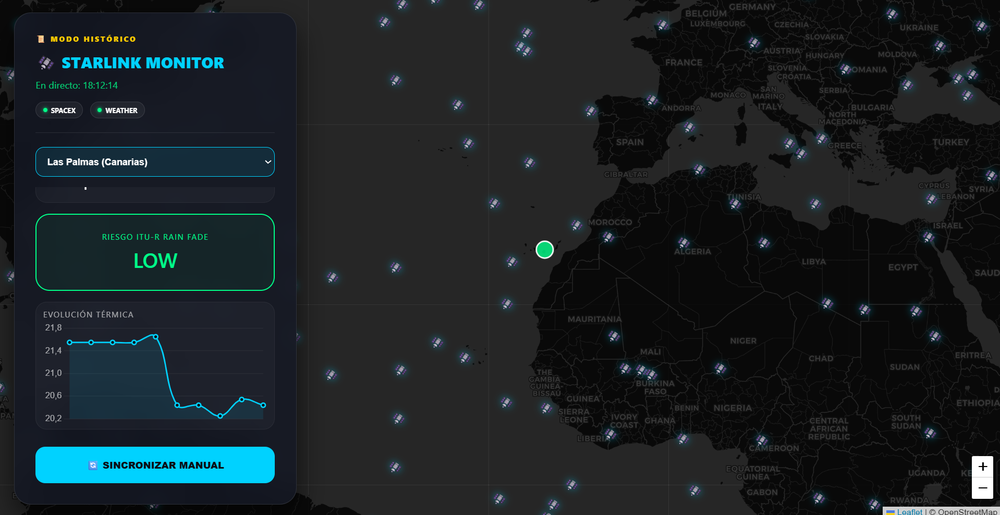
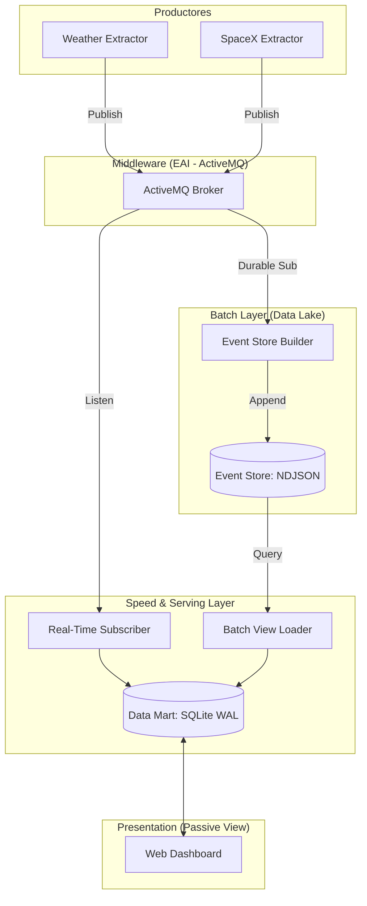
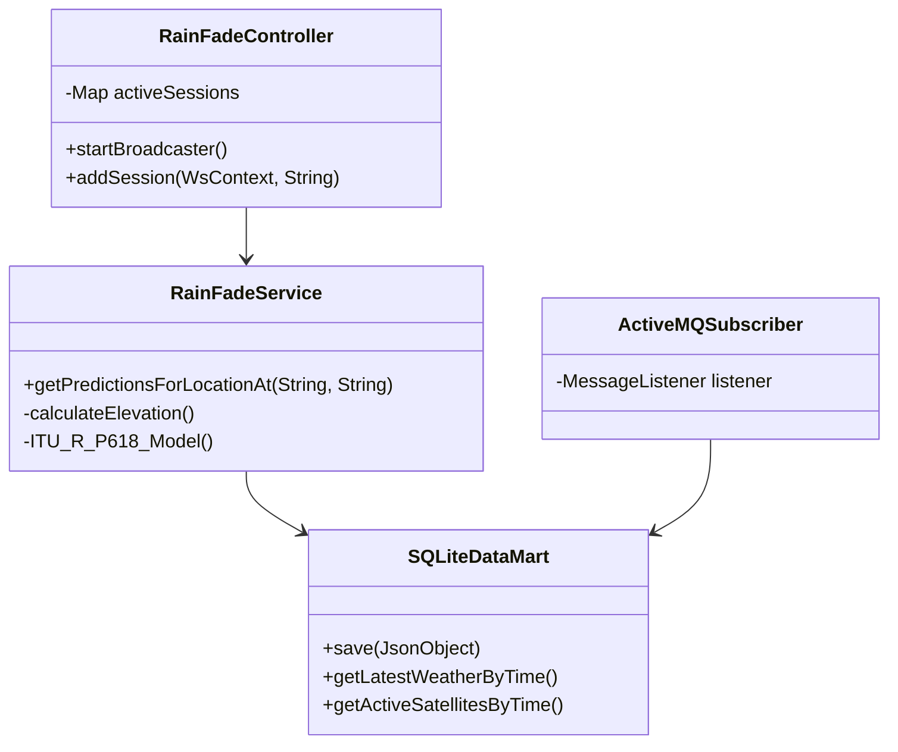

---

# 🛰️ Starlink Rain Fade Monitor - Proyecto DACD (V2.0)

**Desarrollo de Aplicaciones para Ciencia de Datos**
Grado en Ciencia e Ingeniería de Datos | ULPGC

👨‍💻 **Desarrolladores:** Pablo Mellado y Yone Suárez
☕ **Tecnología:** Java 21 | Apache ActiveMQ | Javalin | SQLite (WAL Mode) | Leaflet.js | Chart.js

---



---

## 💡 Propuesta de Valor: Monitorización Predictiva y Análisis Histórico

El **Rain Fade** (atenuación por lluvia) es el factor crítico de inestabilidad en conexiones satelitales de Banda Ku (Starlink). Este sistema actúa como un monitor preventivo que cruza telemetría orbital en tiempo real con datos meteorológicos de alta precisión.

**Novedad V2.0:** Se ha implementado un **Modo Histórico (Time Travel)** que permite retroceder hasta 24 horas para analizar eventos pasados, optimizando el motor de datos para manejar flujos masivos de eventos sin degradar el rendimiento del hardware.

---

## 🛠️ Justificación Técnica

### Elección de APIs
*   **OpenWeatherMap:** Seleccionada por su granularidad en datos de precipitación (rain intensity) y cobertura de nubes, esenciales para el modelo matemático ITU-R P.618.
*   **SpaceX API (Leaf):** Proporciona la telemetría exacta (Lat/Lon) de la constelación Starlink necesaria para calcular ángulos de elevación dinámicos.

### Estructura del Datamart (SQLite High-Performance)
Se ha optado por **SQLite** por su portabilidad, pero aplicando optimizaciones de nivel industrial:
*   **Modo WAL (Write-Ahead Logging):** Permite que la UI lea datos mientras los extractores escriben, eliminando bloqueos de base de datos.
*   **Índices Compuestos:** Optimizados para consultas de series temporales (`location`, `timestamp DESC`).
*   **Idempotencia:** Claves primarias únicas para evitar duplicados en el histórico tras reinicios.

---

## 🏗️ Arquitectura del Sistema (Three-Tier & Lambda)

El sistema está diseñado siguiendo un modelo de **Tres Capas (Three-Tier)** distribuido físicamente mediante contenedores:

1.  **Presentation Tier:** Interfaz Web (HTML/JS) que actúa como un **Passive View**, limitándose a renderizar los datos recibidos sin lógica de negocio.
2.  **Application Tier:** El microservicio `rain-fade-monitor` (Java/Javalin) que implementa las reglas de negocio (modelo ITU-R P.618).
3.  **Data Tier:** Persistencia mediante **Data Marts** locales optimizados.

### Modelo de Integración EAI
En lugar de una integración punto a punto (P2P), el sistema utiliza un modelo de **Integración de Aplicaciones Empresariales (EAI)** mediante **Apache ActiveMQ** como middleware. Esto permite un desacoplamiento total entre los productores de datos (Extractores) y los consumidores.

### Implementación de Arquitectura Lambda
Para garantizar la integridad y disponibilidad de los datos, el sistema implementa una **Arquitectura Lambda**:

*   **Data Lake (Batch Layer):** El `event-store-builder` gestiona un **Data Lake** inmutable en formato NDJSON. Es la "fuente de la verdad" que contiene el histórico completo de eventos en su formato original.
*   **Speed Layer:** El suscriptor de ActiveMQ en el monitor procesa los eventos en tiempo real para compensar la latencia de la capa batch.
*   **Serving Layer (Data Mart):** El Datamart SQLite actúa como un **Data Mart** especializado, una vista parcial y optimizada del Data Lake lista para ser consumida con el mínimo coste de computación.

---

### Diagrama de Arquitectura de Datos

```mermaid
graph TD
    subgraph "Productores"
        WE[Weather Extractor]
        SE[SpaceX Extractor]
    end

    subgraph "Middleware (EAI - ActiveMQ)"
        B[ActiveMQ Broker]
    end

    subgraph "Batch Layer (Data Lake)"
        ES[Event Store Builder]
        HD[(Event Store: NDJSON)]
    end

    subgraph "Speed & Serving Layer"
        AS[Real-Time Subscriber]
        ER[Batch View Loader]
        DM[(Data Mart: SQLite WAL)]
    end

    subgraph "Presentation (Passive View)"
        GUI[Web Dashboard]
    end

    WE & SE --->|Publish| B
    B --->|Durable Sub| ES
    ES --->|Append| HD
    B --->|Listen| AS
    HD --->|Query| ER
    AS & ER --> DM
    DM <---> GUI
```

### Diagrama de Clases (Principales Componentes)

```mermaid
classDiagram
    class RainFadeService {
        +getPredictionsForLocationAt(String, String)
        -calculateElevation()
        -ITU_R_P618_Model()
    }
    class SQLiteDataMart {
        +save(JsonObject)
        +getLatestWeatherByTime()
        +getActiveSatellitesByTime()
    }
    class RainFadeController {
        -Map activeSessions
        +startBroadcaster()
        +addSession(WsContext, String)
    }
    class ActiveMQSubscriber {
        -MessageListener listener
    }

    RainFadeController --> RainFadeService
    RainFadeService --> SQLiteDataMart
    ActiveMQSubscriber --> SQLiteDataMart
```

---

## 🧩 Principios y Patrones de Diseño

*   **Observer (Pub/Sub):** Desacoplamiento total entre extractores y monitor mediante ActiveMQ.
*   **Controller-Service-Repository:** Separación de responsabilidades en la `business-unit`.
*   **Durable Subscriber:** Garantiza que los mensajes del broker se persistan aunque el monitor esté offline.
*   **Clean Code:** Uso de Java Records para inmutabilidad de modelos y gestión de excepciones robusta.

### 3. Paralelización y Concurrencia (Java Concurrency API)
El sistema aprovecha las capacidades multihilo de Java para maximizar el rendimiento:
*   **Thread-Safe SQLite:** Acceso sincronizado al Datamart para permitir lecturas (UI) y escrituras (Extractores) simultáneas sin corrupción de datos.
*   **Extracción Paralela (`CompletableFuture`):** El `WeatherExtractor` ahora realiza peticiones HTTP en paralelo para todas las ubicaciones configuradas.
*   **Cálculo Distribuido (`parallelStream`):** El motor de predicción procesa los cientos de satélites en paralelo utilizando el ForkJoinPool de Java.
*   **WebSocket Broadcaster:** Uso de un `ExecutorService` con pool de hilos para enviar actualizaciones a múltiples clientes Web simultáneamente sin bloquear el ciclo principal.
*   **Monitorización de Hilos:** Se recomienda el uso de **JVisualVM** para inspeccionar el estado de los hilos, detectar bloqueos (deadlocks) y optimizar el consumo de memoria en tiempo real.

### 4. Modelos Inmutables y Event Sourcing
El sistema aplica principios estrictos de diseño orientado a objetos y persistencia:
*   **Java Records:** Todos los modelos de dominio (`WeatherEvent`, `SatelliteEvent`, `RainFadeResponse`) están implementados como **Records**. Esto garantiza que los objetos sean **inmutables** por diseño: no tienen mutadores (setters), todos sus campos son finales y son intrínsecamente seguros para hilos (thread-safe).
*   **Event Sourcing:** Cada cambio de estado en el sistema se captura como un evento inmutable. 
    *   **Data Lake Replay:** El `EventStoreReader` permite la **reconstrucción completa** o parcial del estado de la aplicación reproduciendo los eventos almacenados en el Data Lake.
    *   **Integridad:** Los eventos almacenados nunca se modifican, solo se añaden nuevos (append-only), permitiendo auditar y corregir el estado en cualquier momento.

### 5. Mensajería Asíncrona (ActiveMQ Topics)
El middleware utiliza el patrón de **Topics** (Publicador/Suscriptor):
*   **Escalabilidad:** Múltiples suscriptores (como el `event-store-builder` y el `rain-fade-monitor`) pueden recibir los mismos eventos de forma asíncrona y simultánea sin interferir entre sí.
*   **Garantía de Transmisión:** El uso de suscripciones durables asegura que los eventos no se pierdan incluso si un consumidor está temporalmente fuera de línea, cumpliendo con la responsabilidad de transmisión garantizada.

### 6. Principios SOLID y Patrones de Diseño
El código sigue los estándares de la Ingeniería de Software para garantizar su mantenibilidad:

*   **Single Responsibility (SRP):** Cada microservicio y clase tiene una única razón para cambiar. Por ejemplo, los extractores solo se encargan de la obtención de datos, mientras que el monitor solo gestiona la lógica de atenuación.
*   **Open/Closed (OCP):** El sistema es extensible. Se pueden añadir nuevas ubicaciones o nuevos tipos de satélites sin modificar la lógica central del monitor.
*   **Liskov Substitution (LSP):** El uso de interfaces como `DataMart` permite intercambiar la implementación de SQLite por cualquier otra base de datos (PostgreSQL, MongoDB) sin afectar a los servicios.
*   **Interface Segregation (ISP):** Las interfaces son específicas y granulares para evitar dependencias innecesarias.
*   **Dependency Inversion (DIP):** Los servicios de alto nivel (`RainFadeService`) no dependen de implementaciones concretas (`SQLiteDataMart`), sino de abstracciones (`DataMart`), facilitando las pruebas y el intercambio de componentes.

### 7. Patrones de Arquitectura Avanzados
*   **CQRS (Command Query Responsibility Segregation):** El sistema separa las operaciones de escritura (Extractores enviando eventos) de las de lectura (UI consultando el Data Mart), utilizando modelos de datos diferentes para cada propósito.
*   **MVC (Model-View-Controller):** 
    *   **Model:** Java Records inmutables.
    *   **View:** Dashboard Web (Passive View).
    *   **Controller:** `RainFadeController` gestionando el flujo de datos.
*   **Observer:** Implementado de forma distribuida mediante los **Topics** de ActiveMQ.

### 8. Web APIs y Estrategia de Scraping
El sistema expone y consume interfaces siguiendo los estándares modernos:

*   **REST API v1:** El monitor expone una API REST versionada bajo el prefijo `/api/v1/`.
    *   `GET /api/v1/health`: Verifica la salud del sistema (200 OK).
    *   `GET /api/v1/predictions/{location}?hours=X`: Permite consultas puntuales de predicciones para una ubicación y tiempo histórico específicos.
*   **WebSockets v1:** Comunicación bidireccional en tiempo real bajo `/ws/v1/rainfade` para actualizaciones de telemetría sin sobrecarga de cabeceras HTTP.
*   **Scraping y Consumo de APIs Externas:**
    *   **Consumo de APIs:** Se utilizan librerías como **OkHttp** para realizar peticiones eficientes y robustas a OpenWeatherMap y SpaceX.
    *   **Estrategia de Extracción:** El sistema actúa como un "scraper" de datos meteorológicos y orbitales, transformando información semi-estructurada (JSON/HTTP) en eventos inmutables de alta calidad para el Data Lake.

### 9. Java IO, Serialización y Codificación
El sistema implementa las mejores prácticas de entrada/salida y persistencia de datos:
*   **Gestión de Recursos (`try-with-resources`):** Todas las conexiones a bases de datos, brokers de mensajería (ActiveMQ) y flujos de archivos utilizan el patrón *try-with-resources* de Java para garantizar el cierre automático y seguro de descriptores de archivos y sockets.
*   **IO Eficiente y Buffering:** 
    *   **Lectura:** El `EventStoreReader` utiliza `Files.lines()`, que implementa internamente un `BufferedReader` para procesar flujos masivos de eventos NDJSON de forma eficiente sin saturar la memoria.
    *   **Escritura:** Los extractores envían mensajes de forma asíncrona, aprovechando los buffers de red del sistema operativo y del cliente ActiveMQ.
*   **Serialización JSON (Gson):** Se utiliza **JSON** como formato de intercambio universal. La librería **Gson** permite transformar los objetos (Records) en cadenas de texto para su transmisión por red y almacenamiento en disco, garantizando la interoperabilidad entre microservicios.
*   **Codificación Universal (UTF-8):** Todo el sistema opera bajo el estándar **UTF-8**, asegurando que los caracteres especiales (como nombres de ubicaciones internacionales) se procesen y almacenen correctamente en cualquier sistema operativo.

---

## ⚙️ Requisitos y Ejecución

### 🐋 Ejecución con Docker (Recomendado)
El proyecto orquestra 5 servicios: ActiveMQ, Weather Extractor, SpaceX Extractor, Event Store Builder y Rain Fade Monitor.

1.  **Configurar API Key:**
    ```powershell
    $env:OPENWEATHER_API_KEY="tu_clave_aqui"
    ```
2.  **Lanzamiento:**
    ```bash
    docker-compose up --build
    ```
3.  **Acceso:** `http://localhost:7000`

---

## 🚀 Despliegue y Monitorización (Ingeniería de Software)

El proyecto integra un stack completo de observabilidad y despliegue automatizado:

### 1. CI/CD (GitHub Actions)
*   **Pipeline Automatizado:** El flujo `.github/workflows/maven.yml` realiza dos tareas críticas:
    1.  **Build & Test:** Compila el proyecto con Maven.
    2.  **Docker Build Check:** Verifica que los `Dockerfiles` de cada microservicio sean válidos y construyan imágenes funcionales.

### 2. Monitorización y Observabilidad
*   **Logging Estructurado (Logback):** Todos los módulos generan logs profesionales.
    *   **Consola + Archivo:** Cada servicio escribe en su propio archivo en la carpeta `/logs` (ej. `weather-extractor.log`).
*   **Métricas con Micrometer & Prometheus:** 
    *   **Endpoint `/metrics`:** El monitor expone métricas en tiempo real en formato Prometheus.
    *   **Custom Metrics:** Se trackea el número total de conexiones WebSocket (`websocket_connections_total`).
*   **Stack de Visualización:**
    *   **Prometheus:** Recolecta métricas cada 15s (`http://localhost:9090`).
    *   **Grafana:** Listo para crear dashboards personalizados (`http://localhost:3000`).

### 3. Despliegue con Docker
El sistema utiliza imágenes **multietapa** (distroless-like) basadas en JRE 21 para minimizar el tamaño y la superficie de ataque.

| Servicio | Puerto | Descripción |
| :--- | :--- | :--- |
| **ActiveMQ** | 61616 / 8161 | Broker de mensajería y panel web. |
| **Rain Fade Monitor** | 7000 | Backend Javalin, UI y métricas. |
| **Prometheus** | 9090 | Base de datos de series temporales. |
| **Grafana** | 3000 | Visualización de dashboards. |

---

## 🔍 Guía de Verificación (Showcase para Presentación)

Para demostrar el flujo de datos real y la arquitectura distribuida del sistema, se recomiendan las siguientes comprobaciones durante la evaluación:

### 1. Flujo de Datos en Tiempo Real (ActiveMQ)
Acceder al panel de control del Broker: [http://localhost:8161/admin/](http://localhost:8161/admin/) (Credenciales: `admin` / `admin`).
*   **Comprobación:** En la pestaña `Topics`, observar cómo aumentan los contadores de `Messages Enqueued` en `sensor.SpaceX` y `prediction.Weather`. Esto demuestra el desacoplamiento total entre los extractores y el monitor mediante el modelo EAI.

### 2. Trazabilidad y Logs (Docker)
Ejecutar el siguiente comando en la terminal para ver la actividad del servidor en vivo:
```bash
docker logs -f starlink-monitor-service
```
*   **Qué observar:** El proceso de carga inicial de 50,000 eventos (Batch Layer), la conexión al broker y la apertura/cierre de túneles WebSocket al interactuar con la web.

### 3. Observabilidad y Métricas (Grafana)
Acceder a [http://localhost:3000](http://localhost:3000) (Credenciales: `admin` / `admin`).
*   **Dashboard:** Seleccionar el "Starlink Monitor Dashboard".
*   **Comprobación:** Observar las gráficas de conexiones WebSocket, uso de CPU y memoria. Es la prueba de que el sistema está siendo monitorizado profesionalmente con el stack Prometheus + Grafana.

### 4. Modo Histórico (Event Sourcing)
En la interfaz web ([http://localhost:7000](http://localhost:7000)), desplazar el slider de "Modo de Visualización" hacia atrás.
*   **Qué observar:** El monitor recuperará instantáneamente datos del Data Mart (SQLite) correspondientes al pasado, demostrando la persistencia y la capacidad de "Time Travel" de la arquitectura Lambda implementada.

---
**DACD 2026**
