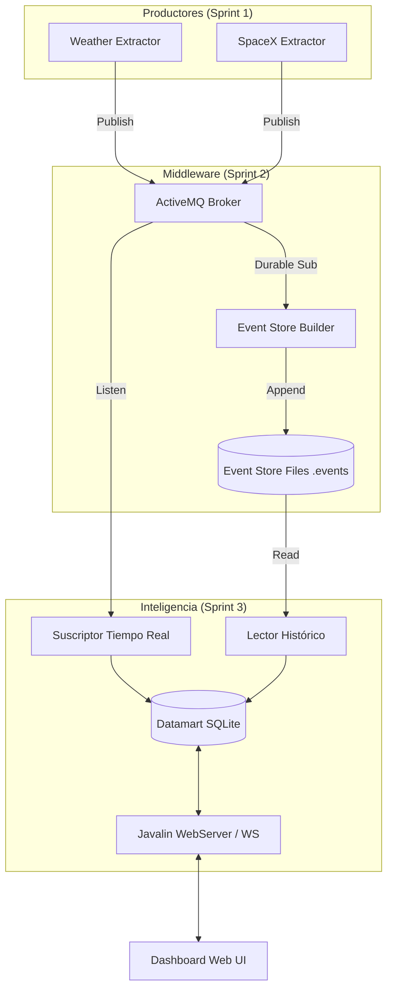
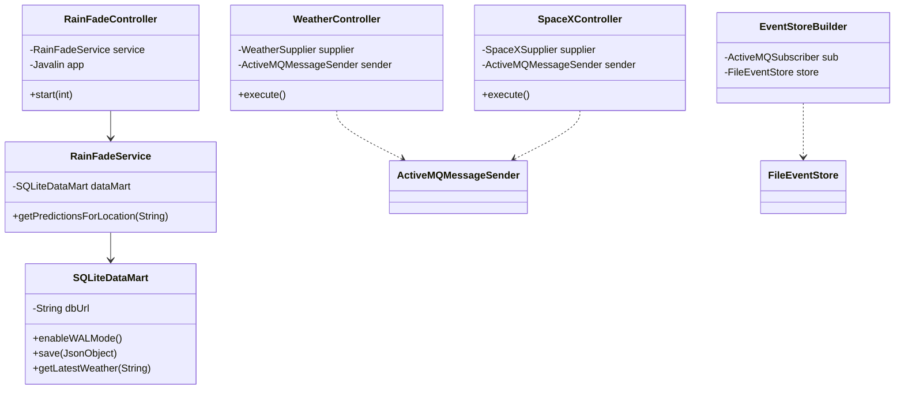

---

# 🛰️ Starlink Rain Fade Monitor - Proyecto DACD

**Desarrollo de Aplicaciones para Ciencia de Datos**
Grado en Ciencia e Ingeniería de Datos | ULPGC

👨‍💻 **Desarrolladores:** Pablo Mellado y Yone Suárez
☕ **Tecnología:** Java 21 (Modular Maven Project) | Apache ActiveMQ | Javalin | Leaflet.js

---

## 💡 Propuesta de Valor: Monitorización Predictiva de "Rain Fade"

El **Rain Fade** (atenuación por lluvia) es el principal factor de inestabilidad en las conexiones satelitales que operan en la Banda Ku (como Starlink de SpaceX). El objetivo de este sistema es actuar como un Monitor Predictivo, cruzando dos flujos de datos dinámicos en tiempo real:

1. **Telemetría Orbital:** Posición exacta (Latitud/Longitud) de los satélites de la constelación SpaceX.
2. **Meteorología Crítica:** Intensidad de precipitación y densidad de nubes (OpenWeatherMap) en las Islas Canarias.

**Resultado:** Un tablero de control que predice microcortes y alerta visualmente al usuario mediante un código de colores de riesgo y mapeo de interferencias antes de que se produzca la degradación de la señal. Esto aporta un valor crítico a nómadas digitales, empresas y trabajadores autónomos en Canarias que dependen de conexiones satelitales estables para operar.

---

## 🏗️ Arquitectura del Sistema (Multimódulo EDA)

El proyecto implementa una arquitectura de **Microservicios Desacoplados** comunicados mediante un bus de eventos (Event-Driven Architecture), diseñada bajo los principios de *Clean Code* y maximizando el principio DRY:

### Módulos del Proyecto
* **`spacex-extractor` & `weather-extractor` (Productores):** Feeders que capturan telemetría orbital y clima local desde APIs externas, inyectándolos en el ecosistema (topics `sensor.SpaceX` y `prediction.Weather`).
* **`event-store-builder` (Data Lake):** Implementa el patrón *Durable Subscriber*, escuchando al broker y persistiendo los eventos crudos en formato NDJSON. Actúa como la *Single Source of Truth* histórica.
* **`rain-fade-monitor` (Business Unit & API):** El cerebro del sistema. Implementa una **Arquitectura Lambda**, cargando históricos del Event Store (batch) y sincronizando el estado en tiempo real vía ActiveMQ (stream). Persiste y consulta datos en un **Datamart SQLite**.

### 🗺️ Diagrama de Arquitectura Unificada


```mermaid
graph TD
    subgraph "Productores (Sprint 1)"
        WE[Weather Extractor]
        SE[SpaceX Extractor]
    end

    subgraph "Middleware (Sprint 2)"
        B[ActiveMQ Broker]
        ES[Event Store Builder]
        HD[(Event Store Files .events)]
    end

    subgraph "Inteligencia (Sprint 3)"
        AS[Suscriptor Tiempo Real]
        ER[Lector Histórico]
        DM[(Datamart SQLite)]
        API[Javalin WebServer / WS]
    end

    GUI[Dashboard Web UI]

    WE --->|Publish| B
    SE --->|Publish| B
    B --->|Durable Sub| ES
    ES --->|Append| HD
    B --->|Listen| AS
    HD --->|Read| ER
    AS & ER --> DM
    DM <---> API
    API <---> GUI
```

### 🧬 Diagrama de Clases Principal


```mermaid
classDiagram
    class WeatherController {
        -WeatherSupplier supplier
        -ActiveMQMessageSender sender
        +execute()
    }
    class SpaceXController {
        -SpaceXSupplier supplier
        -ActiveMQMessageSender sender
        +execute()
    }
    class EventStoreBuilder {
        -ActiveMQSubscriber sub
        -FileEventStore store
    }
    class RainFadeService {
        -SQLiteDataMart dataMart
        +getPredictionsForLocation(String)
    }
    class SQLiteDataMart {
        -String dbUrl
        +enableWALMode()
        +save(JsonObject)
        +getLatestWeather(String)
    }
    class RainFadeController {
        -RainFadeService service
        -Javalin app
        +start(int)
    }

    WeatherController ..> ActiveMQMessageSender
    SpaceXController ..> ActiveMQMessageSender
    EventStoreBuilder ..> FileEventStore
    RainFadeController --> RainFadeService
    RainFadeService --> SQLiteDataMart
```

---

## 🧩 Patrones de Diseño y Decisiones Técnicas

* **Arquitectura Lambda:** Unifica el procesamiento por lotes (batch) de 40k+ eventos históricos con el flujo en tiempo real (stream), garantizando que el monitor siempre tenga datos previos para las gráficas.
* **Java Records (Java 21):** Uso de inmutabilidad para modelos como `WeatherEvent` y `SatelliteEvent`, asegurando la integridad de los datos en entornos concurrentes.
* **Publisher/Subscriber (Observer):** Desacoplamiento total mediante ActiveMQ. Los extractores no conocen al monitor ni al event store.
* **SQLite WAL Mode (Write-Ahead Logging):** Configuración avanzada de la base de datos que permite lecturas y escrituras simultáneas. Vital para que la carga de históricos no bloquee la visualización en el mapa.
* **WebSockets (Full Duplex):** El monitor "empuja" actualizaciones cada 2 segundos a los clientes conectados, eliminando la necesidad de refrescar la página.

---

## ⚙️ Requisitos y Ejecución

### Opción A: Ejecución Rápida (Recomendado) 🐋
El proyecto está totalmente contenedorizado. Solo necesitas Docker Desktop instalado:

1. Clona el repositorio.
2. Abre una terminal en la raíz y ejecuta:
   ```bash
   docker-compose up --build
   ```
3. Accede a `http://localhost:7000`.

### Opción B: Ejecución Manual (Entorno Local)
1. **Requisitos:** Java 21, Maven y ActiveMQ (61616).
2. **Variable de Entorno:** Exporta `OPENWEATHER_API_KEY`.
3. **Instalación:** `mvn clean install`.
4. **Orden de arranque:** ActiveMQ -> EventStoreBuilder -> RainFadeMonitor -> Extractores.

---

## 📊 Explotación de Datos

La Business Unit expone los datos procesados para su integración:

### 1. API WebSocket (Tiempo Real)
* **Endpoint:** `ws://localhost:7000/ws/rainfade`
* **Mensaje de entrada:** `"Las Palmas"`, `"London"`, etc.
* **Respuesta:** JSON con telemetría, historial térmico y riesgo de interferencia.

### 2. Dashboard Web (GUI)
Accede a `http://localhost:7000/`. El panel incluye:
* **Mapa Leaflet:** Visualización de satélites y líneas de interferencia.
* **Chart.js:** Gráfica de evolución térmica de las últimas 10 capturas.
* **Monitor de Riesgo:** Indicador dinámico (LOW/MEDIUM/HIGH) basado en el clima.